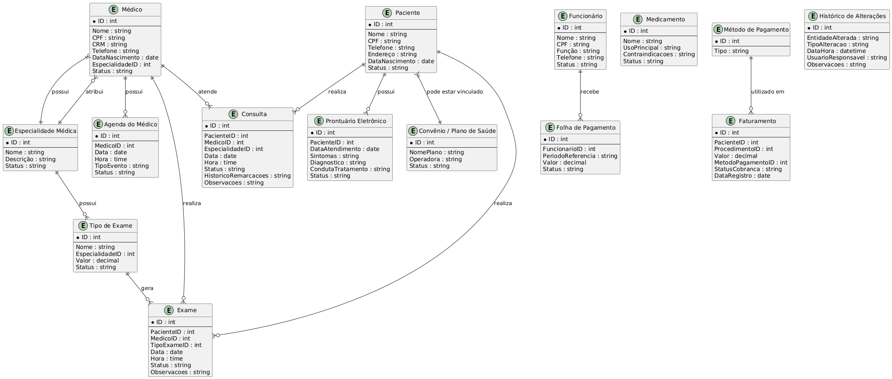

# Modelos de Domínio

Nesta seção, podem ser criados diagramas que ilustram as relações entre as entidades do sistema, como Paciente, Médico, Consulta, Exame, Faturamento, entre outros. Isso pode incluir um diagrama de classes ou um diagrama de entidade-relacionamento (ERD), que ajudaria a visualizar como as entidades se conectam.

*PASSO A PASSO PARA COMPLETAR ESTE PONTO*

- [X] Listar todas as entidades do sistema (baseadas nas funcionalidades que você já detalhou).
- [X] Definir atributos essenciais para cada entidade (ex.: Paciente → nome, CPF, telefone).
- [ ] Desenhar primeiro ERD básico com relacionamentos e cardinalidades.
- [ ] Complementar com diagramas UML de classes para representar métodos-chave e responsabilidades.
- [ ] Adicionar visão de agregados / contextos delimitados para evidenciar limites de consistência.
- [ ] Revisar com stakeholders para validar se as relações refletem corretamente o negócio.

## 1. Lista de Entidades

Descrição de todas as entidades do sistema com base nas [funcionalidades](https://docs.google.com/document/d/1auJg1NmKtMBiqDIhDSnEi9d4suQ18K6Cu7m3Uy2VmXY/edit?tab=t.0), regras de negócio e relacionamentos implícitos. As entidades estão separadas em grupos para facilitar a visualização.

### 1. Core Clínico

- Paciente – pessoa que recebe atendimento médico; possui dados cadastrais e prontuário.
- Médico – profissional de saúde cadastrado na clínica; possui CRM, especialidade, disponibilidade.
- Funcionário – colaboradores da clínica que não são médicos (enfermeiros, recepcionistas, etc.).
- Especialidade Médica – área de atuação de médicos (cardiologia, pediatria, ortopedia, etc.).
- Consulta – agendamento entre paciente e médico para atendimento; possui data, horário, status, histórico de remarcações.
- Prontuário Eletrônico – histórico clínico do paciente, incluindo sintomas, diagnósticos e tratamentos.  

### 2. Exames e Medicamentos

- Exame – procedimento médico solicitado, vinculado a paciente, médico e tipo de exame; possui data, horário, status.
- Tipo de Exame – cadastro de tipos de exames realizados na clínica (raio-x, sangue, ultrassonografia), associado a uma especialidade.
- Medicamento – substâncias utilizadas em prescrições, com nome, uso e contraindicações.  

### 3. Financeiro

- Faturamento – registro financeiro de consultas, exames ou serviços prestados; contém valor, método de pagamento e status.
- Método de Pagamento – forma de quitação do faturamento (cartão, dinheiro, convênio, reembolso).
- Status de Cobrança – situação atual do faturamento (Pago, Pendente, Cancelado).
- Folha de Pagamento – registro de pagamento de funcionários, contendo valores, período de referência e status.  

### 4. Convênios e Planos de Saúde

- Convênio/Plano de Saúde – contrato com operadora de saúde; pacientes podem estar vinculados a um plano.  

### 5. Auxiliares / Suporte

- Agenda do Médico – horários disponíveis e ocupados para consultas e exames.
- Histórico de Alterações – log de modificações em consultas, exames, prontuários, medicamentos e pagamentos.

## 2. Definindo Atributos das Entidades


| Entidade                  | Atributos Essenciais                                                                                                                                                                    | Observações                                                                                 |
| ------------------------- | --------------------------------------------------------------------------------------------------------------------------------------------------------------------------------------- | ------------------------------------------------------------------------------------------- |
| Paciente                  | ID, Nome, CPF, Telefone, Endereço, Data de Nascimento, Status (Ativo/Inativo), Data de Cadastro, Convênio (opcional)                                                                    | Pessoa que recebe atendimento médico; vinculada a consultas, exames e prontuários           |
| Médico                    | ID, Nome, CPF, CRM, Telefone, Data de Nascimento, Especialidade Principal, Status (Ativo/Inativo), Disponibilidade (horários)                                                           | Profissional de saúde cadastrado na clínica; vinculado a consultas, exames e especialidades |
| Funcionário               | ID, Nome, CPF, Função, Telefone/Contato, Status (Ativo/Inativo)                                                                                                                         | Colaboradores que não são médicos (enfermeiros, recepcionistas, etc.)                       |
| Especialidade Médica      | ID, Nome, Descrição (opcional), Status (Ativa/Inativa)                                                                                                                                  | Área de atuação de médicos; vinculada a médicos e tipos de exame                            |
| Consulta                  | ID, Paciente (link), Médico (link), Especialidade (link), Data, Hora, Status (Agendada, Confirmada, Remarcada, Cancelada), Histórico de Remarcações, Observações/Motivo de Cancelamento | Agendamento entre paciente e médico; vinculado à agenda do médico                           |
| Prontuário Eletrônico     | ID, Paciente (link), Data do Atendimento, Sintomas, Diagnóstico, Conduta/Tratamento, Status (Ativo/Inativo), Histórico de Alterações                                                    | Histórico clínico do paciente; registro imutável de versões anteriores                      |
| Exame                     | ID, Paciente (link), Médico (link), Tipo de Exame (link), Data, Hora, Status (Agendado, Realizado, Cancelado), Histórico de Alterações, Observações/Motivo de Cancelamento              | Procedimento médico vinculado a paciente, médico e tipo de exame                            |
| Tipo de Exame             | ID/Código, Nome/Descrição, Especialidade (link), Valor, Status (Ativo/Inativo)                                                                                                          | Cadastro dos tipos de exames realizados na clínica                                          |
| Medicamento               | ID, Nome, Uso Principal, Contraindicações, Status (Ativo/Inativo)                                                                                                                       | Substâncias usadas em prescrições; nome único                                               |
| Faturamento               | ID, Paciente (link), Procedimento (Consulta ou Exame, link), Valor, Método de Pagamento (link), Status de Cobrança (Pago, Pendente, Cancelado), Data do Registro                        | Registro financeiro de serviços prestados                                                   |
| Método de Pagamento       | ID, Tipo (Cartão, Dinheiro, Convênio, Reembolso)                                                                                                                                        | Forma de quitação do faturamento                                                            |
| Status de Cobrança        | Código, Descrição (Pago, Pendente, Cancelado)                                                                                                                                           | Indica situação do faturamento                                                              |
| Folha de Pagamento        | ID, Funcionário (link), Período de Referência (Mês/Ano), Valor, Status (Pendente, Pago)                                                                                                 | Registro de pagamento de funcionários                                                       |
| Convênio / Plano de Saúde | ID, Nome do Plano, Operadora, Status (Ativo/Inativo)                                                                                                                                    | Contrato com operadora de saúde; vinculado a pacientes                                      |
| Agenda do Médico          | ID, Médico (link), Data, Horário, Tipo de Evento (Consulta, Exame), Status (Ocupado, Disponível)                                                                                        | Controle de horários disponíveis e ocupados do médico                                       |
| Histórico de Alterações   | ID, Entidade Alterada, Tipo de Alteração (Criar, Atualizar, Excluir, Cancelar), Data/Hora, Usuário Responsável, Observações                                                             | Registro de log para rastreabilidade de modificações                                        |

### 3. Primeiro ERD básico

```
@startuml  
' Definição das entidades do MEDFLOW  
  
entity "Paciente" as Paciente {  
  *ID : int  
  --  
  Nome : string  
  CPF : string  
  Telefone : string  
  Endereço : string  
  DataNascimento : date  
  Status : string  
}  
  
entity "Médico" as Medico {  
  *ID : int  
  --  
  Nome : string  
  CPF : string  
  CRM : string  
  Telefone : string  
  DataNascimento : date  
  EspecialidadeID : int  
  Status : string  
}  
  
entity "Funcionário" as Funcionario {  
  *ID : int  
  --  
  Nome : string  
  CPF : string  
  Função : string  
  Telefone : string  
  Status : string  
}  
  
entity "Especialidade Médica" as Especialidade {  
  *ID : int  
  --  
  Nome : string  
  Descrição : string  
  Status : string  
}  
  
entity "Consulta" as Consulta {  
  *ID : int  
  --  
  PacienteID : int  
  MedicoID : int  
  EspecialidadeID : int  
  Data : date  
  Hora : time  
  Status : string  
  HistoricoRemarcacoes : string  
  Observacoes : string  
}  
  
entity "Prontuário Eletrônico" as Prontuario {  
  *ID : int  
  --  
  PacienteID : int  
  DataAtendimento : date  
  Sintomas : string  
  Diagnostico : string  
  CondutaTratamento : string  
  Status : string  
}  
  
entity "Exame" as Exame {  
  *ID : int  
  --  
  PacienteID : int  
  MedicoID : int  
  TipoExameID : int  
  Data : date  
  Hora : time  
  Status : string  
  Observacoes : string  
}  
  
entity "Tipo de Exame" as TipoExame {  
  *ID : int  
  --  
  Nome : string  
  EspecialidadeID : int  
  Valor : decimal  
  Status : string  
}  
  
entity "Medicamento" as Medicamento {  
  *ID : int  
  --  
  Nome : string  
  UsoPrincipal : string  
  Contraindicacoes : string  
  Status : string  
}  
  
entity "Faturamento" as Faturamento {  
  *ID : int  
  --  
  PacienteID : int  
  ProcedimentoID : int  
  Valor : decimal  
  MetodoPagamentoID : int  
  StatusCobranca : string  
  DataRegistro : date  
}  
  
entity "Método de Pagamento" as MetodoPagamento {  
  *ID : int  
  --  
  Tipo : string  
}  
  
entity "Folha de Pagamento" as FolhaPagamento {  
  *ID : int  
  --  
  FuncionarioID : int  
  PeriodoReferencia : string  
  Valor : decimal  
  Status : string  
}  
  
entity "Convênio / Plano de Saúde" as Convenio {  
  *ID : int  
  --  
  NomePlano : string  
  Operadora : string  
  Status : string  
}  
  
entity "Agenda do Médico" as Agenda {  
  *ID : int  
  --  
  MedicoID : int  
  Data : date  
  Hora : time  
  TipoEvento : string  
  Status : string  
}  
  
entity "Histórico de Alterações" as HistoricoAlteracoes {  
  *ID : int  
  --  
  EntidadeAlterada : string  
  TipoAlteracao : string  
  DataHora : datetime  
  UsuarioResponsavel : string  
  Observacoes : string  
}  
  
' Relacionamentos  
Paciente ||--o{ Consulta : "realiza"  
Paciente ||--o{ Exame : "realiza"  
Paciente ||--o{ Prontuario : "possui"  
Paciente }|--|| Convenio : "pode estar vinculado"  
  
Medico ||--o{ Consulta : "atende"  
Medico ||--o{ Exame : "realiza"  
Medico }|--|| Especialidade : "possui"  
Medico ||--o{ Agenda : "possui"  
  
Funcionario ||--o{ FolhaPagamento : "recebe"  
  
Especialidade ||--o{ Medico : "atribui"  
Especialidade ||--o{ TipoExame : "possui"

TipoExame ||--o{ Exame : "gera"

MetodoPagamento ||--o{ Faturamento : "utilizado em"

@enduml
```

### 4. Diagramas UML de classes




### 5. Visão de agregados / contextos delimitados


### 6. Revisão com stakeholders


---
